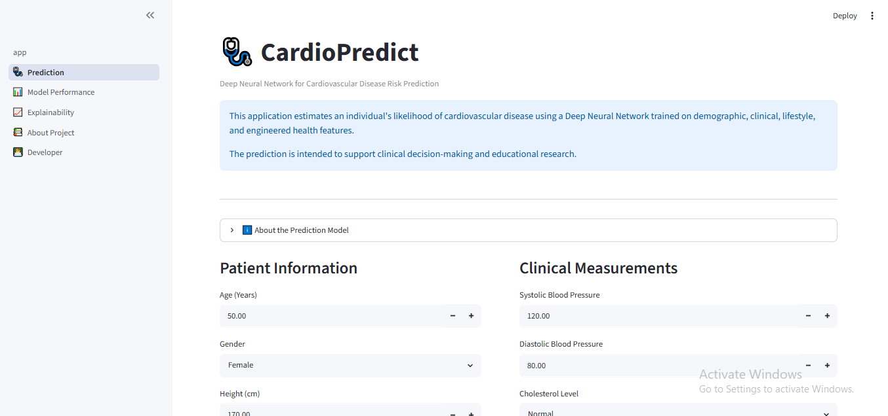
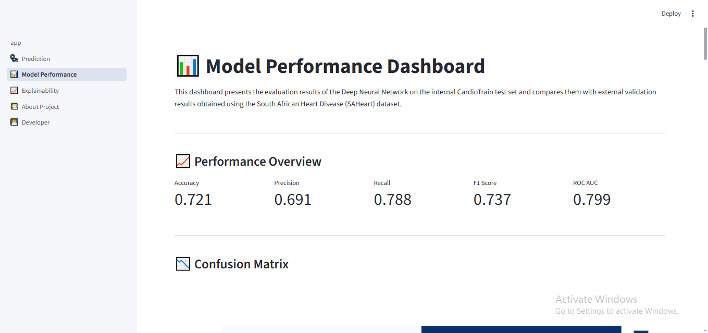
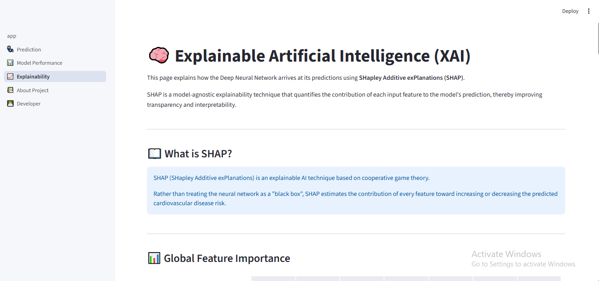
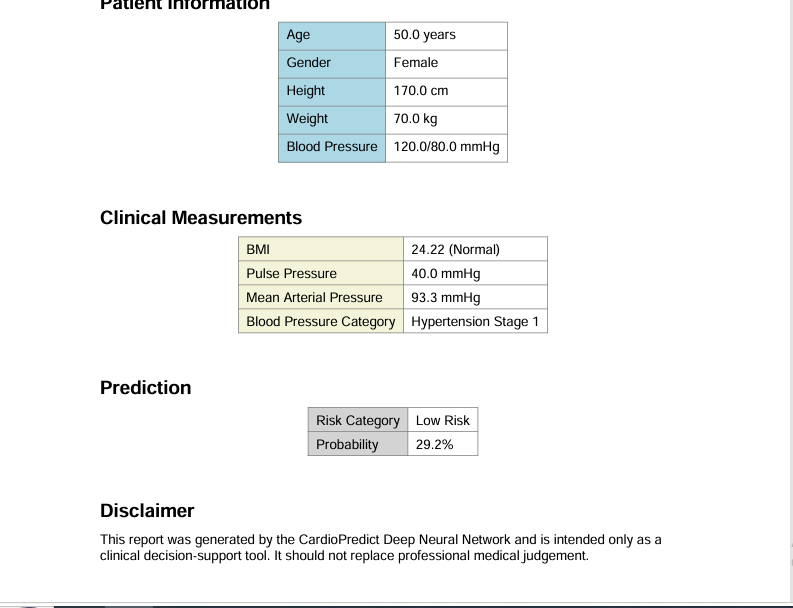

# 🫀 CardioPredict

> **An end-to-end Deep Learning application for Cardiovascular Disease Risk Prediction with Explainable AI and Professional Clinical Reporting.**


---

## 📌 Project Overview

CardioPredict is a machine learning web application that estimates an individual's likelihood of developing cardiovascular disease using a **Deep Neural Network (DNN)** trained on demographic, clinical, lifestyle, and engineered physiological features.

Beyond prediction, the application emphasizes **model transparency and clinical usability** through SHAP-based explainability, comprehensive performance evaluation, external validation, and downloadable PDF clinical reports.

The project demonstrates an end-to-end machine learning workflow, including:

* Data preprocessing and feature engineering
* Deep Neural Network model development
* Model evaluation and external validation
* Explainable AI (SHAP)
* Interactive Streamlit deployment
* Automated clinical PDF report generation

---

## 🎯 Project Highlights

✅ Deep Neural Network (TensorFlow/Keras)

✅ End-to-end Machine Learning Pipeline

✅ Feature Engineering (BMI, MAP, Pulse Pressure)

✅ External Validation (SAHeart Dataset)

✅ Explainable AI with SHAP

✅ Professional Streamlit Web Application

✅ Automated PDF Report Generation

✅ Modular Python Project Structure

---

# 🖼️ Application Preview

## Home Page


---

## Cardiovascular Risk Prediction



---

## Prediction Results


---

## Model Performance



---

## Explainability (SHAP)



---

## Generated Clinical Report



---

## ✨ Key Features

### 🩺 Cardiovascular Risk Prediction

* Predicts the probability of cardiovascular disease using a trained Deep Neural Network.
* Provides probability scores together with Low, Moderate, and High risk classifications.
* Validates blood pressure inputs before prediction.

### 🧮 Clinical Feature Engineering

The application automatically computes clinically relevant derived features including:

* Body Mass Index (BMI)
* Pulse Pressure
* Mean Arterial Pressure (MAP)

These engineered features improve the predictive capability of the model.

### 📊 Interactive Results Dashboard

After prediction, the application displays:

* Estimated disease probability
* Risk category
* Patient summary
* Derived clinical measurements
* Clinical interpretation
* Progress indicator

### 📄 Professional PDF Report

Users can generate a downloadable clinical report containing:

* Patient information
* Prediction probability
* Risk category
* Clinical measurements
* Report generation date
* Unique report ID
* Medical disclaimer

### 📈 Model Performance Evaluation

The application includes a dedicated model evaluation page presenting:

* Accuracy
* Precision
* Recall
* F1 Score
* ROC-AUC
* Confusion Matrix
* ROC Curve
* Precision–Recall Curve

### 🌍 External Validation

To evaluate generalization, the trained model was tested on the South African Heart Disease (SAHeart) dataset.

Performance metrics from both the internal CardioTrain test set and the external dataset are presented for comparison.

### 🧠 Explainable AI (SHAP)

Model predictions are complemented with SHAP (SHapley Additive exPlanations), allowing users to explore:

* Global feature importance
* SHAP summary visualization
* Clinical interpretation of influential variables

This improves transparency and interpretability of the Deep Neural Network.

---

# 🛠️ Technology Stack

| Category             | Technologies                    |
| -------------------- | ------------------------------- |
| Programming Language | Python 3.12                     |
| Machine Learning     | TensorFlow, Keras, Scikit-learn |
| Data Processing      | Pandas, NumPy                   |
| Explainable AI       | SHAP                            |
| Data Visualization   | Matplotlib, Plotly              |
| Web Framework        | Streamlit                       |
| Model Serialization  | Joblib                          |
| PDF Generation       | ReportLab                       |
| Image Processing     | Pillow                          |

---

# 📁 Project Structure

```text
cardio_project/
│
├── app.py
├── pages/
│   ├── Home.py
│   ├── Prediction.py
│   ├── Model_Performance.py
│   └── Explainability.py
│
├── utils/
│   ├── prediction.py
│   ├── calculations.py
│   ├── pdf_report.py
│   ├── constants.py
│   └── footer.py
│
├── models/
│
├── assets/
│   └── images/
│
├── requirements.txt
├── LICENSE
└── README.md
```

---

# 🤖 Machine Learning Pipeline

## Dataset

The model was trained using the **Cardiovascular Disease Dataset (CardioTrain)**, which contains demographic, physiological, metabolic, and lifestyle information collected from adult patients.

The dataset includes clinical variables commonly associated with cardiovascular disease risk, such as:

* Age
* Gender
* Height
* Weight
* Systolic Blood Pressure
* Diastolic Blood Pressure
* Cholesterol Level
* Glucose Level
* Smoking Status
* Alcohol Consumption
* Physical Activity

The target variable is a binary classification indicating the presence or absence of cardiovascular disease.

---

## Data Preprocessing

The following preprocessing steps were performed before model training:

* Removed duplicate observations
* Checked for missing values
* Verified data integrity
* Scaled numerical features using **StandardScaler**
* Encoded categorical variables
* Split the dataset into training and testing subsets

Proper preprocessing ensured that all features were suitable for Deep Neural Network training.

---

## Feature Engineering

To improve predictive performance, three clinically meaningful features were engineered from the original dataset:

### Body Mass Index (BMI)

Calculated using patient height and weight.

BMI provides a standardized indicator of body composition and obesity risk.

---

### Pulse Pressure

Calculated as:

> Pulse Pressure = Systolic Blood Pressure − Diastolic Blood Pressure

Pulse Pressure reflects arterial stiffness and cardiovascular health.

---

### Mean Arterial Pressure (MAP)

Calculated as:

> MAP = Diastolic Pressure + (Pulse Pressure ÷ 3)

MAP estimates the average arterial pressure during a single cardiac cycle and is widely used in clinical practice.

---

## Deep Neural Network Architecture

The prediction model was implemented using **TensorFlow/Keras**.

The architecture consists of multiple fully connected (Dense) layers with nonlinear activation functions to capture complex relationships between patient characteristics and cardiovascular disease risk.

Key characteristics include:

* Dense hidden layers
* ReLU activation functions
* Sigmoid output layer
* Binary Cross-Entropy loss
* Adam optimizer

The model outputs a probability between **0** and **1**, representing the estimated likelihood of cardiovascular disease.

---

## Model Training

During training, the network learned nonlinear relationships between demographic, physiological, metabolic, lifestyle, and engineered clinical features.

Model performance was monitored using validation data to evaluate generalization and reduce the risk of overfitting.

---

# 📊 Model Performance

The trained Deep Neural Network achieved the following performance on the internal CardioTrain test dataset.

| Metric    | Score |
| --------- | ----: |
| Accuracy  | 0.720 |
| Precision | 0.689 |
| Recall    | 0.790 |
| F1 Score  | 0.736 |
| ROC-AUC   | 0.799 |

These results indicate good predictive performance while maintaining a strong balance between sensitivity and precision.

---

# 🌍 External Validation

To evaluate robustness, the trained model was tested on the **South African Heart Disease (SAHeart)** dataset.

| Metric    | Score |
| --------- | ----: |
| Accuracy  | 0.571 |
| Precision | 0.432 |
| Recall    | 0.756 |
| F1 Score  | 0.550 |
| ROC-AUC   | 0.664 |

Although performance decreased compared with the internal test set, the model retained moderate discriminatory ability on an independent African population. This demonstrates reasonable generalization while also highlighting opportunities for future improvement through additional training data and feature enrichment.

---

# 🧠 Explainable AI (SHAP)

Healthcare machine learning models should be transparent as well as accurate.

To improve interpretability, SHAP (SHapley Additive exPlanations) was incorporated into the project.

The Explainability page allows users to explore:

* Global feature importance
* SHAP summary plots
* Relative contribution of each feature
* Clinical interpretation of influential variables

This helps users understand **which variables drive model predictions**, increasing trust and supporting responsible AI practices in healthcare.

---

# 🚀 Installation

## Clone the Repository

```bash
git clone https://github.com/YOUR_USERNAME/CardioPredict.git
```

## Navigate to the Project Directory

```bash
cd CardioPredict
```

## Create a Virtual Environment

### Windows

```bash
python -m venv .venv
```

Activate the environment:

```bash
.\.venv\Scripts\Activate.ps1
```

### macOS / Linux

```bash
python3 -m venv .venv
source .venv/bin/activate
```

---

## Install Dependencies

```bash
pip install -r requirements.txt
```

---

# ▶️ Running the Application

Launch the Streamlit application with:

```bash
streamlit run app.py
```

After launching, Streamlit will display a local URL (typically `http://localhost:8501`) where you can access the application in your browser.

---

# 💡 Future Improvements

Potential enhancements for future versions include:

* Integration with electronic health record (EHR) systems
* Additional cardiovascular biomarkers and laboratory measurements
* Hyperparameter optimization using Bayesian optimization
* Comparison with traditional machine learning models (e.g., Random Forest, XGBoost)
* Docker containerization for simplified deployment
* User authentication and patient history tracking
* REST API for integration with external healthcare systems

---

# 📚 Acknowledgements

This project was developed as an end-to-end machine learning portfolio project to demonstrate practical skills in:

* Data preprocessing
* Feature engineering
* Deep learning
* Model evaluation
* External validation
* Explainable AI
* Interactive web application development
* Automated report generation

Special thanks to the open-source Python community and the developers of TensorFlow, Streamlit, SHAP, Scikit-learn, Pandas, Plotly, and ReportLab for providing the tools that made this project possible.

---

# 👨‍💻 Author

**Achesomie Goni Yifieyeh**

Machine Learning Engineer | Data Scientist | AI Developer

### Connect with Me

* GitHub: https://github.com/Achese-creator
* LinkedIn: https://www.linkedin.com/in/maverickhoodie

---

# 📄 License

This project is licensed under the MIT License. See the `LICENSE` file for additional details.
